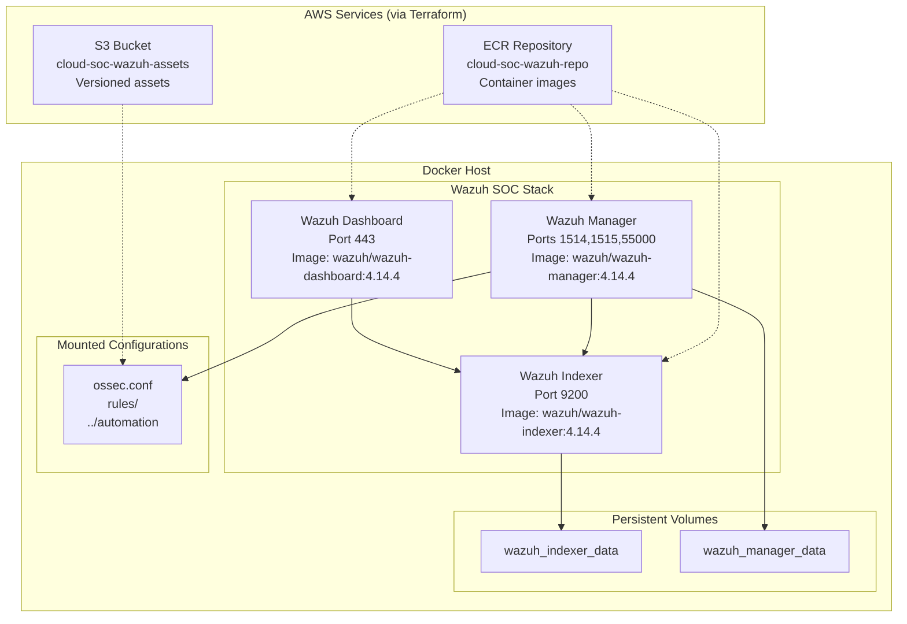

# docker-soc

This folder contains the Docker-based Wazuh single-node SOC stack, aligned with Wazuh Docker deployment best practices and the repository's AWS S3/ECR automation plan.

## Architecture Overview



This diagram shows the Wazuh single-node stack components, their interconnections, persistent storage, and integration with AWS S3/ECR services provisioned by Terraform.

## 1. Requirements
- Docker Engine
- Docker Compose v2 or higher
- `sysctl -w vm.max_map_count=262144` on the Docker host before starting the indexer
- AWS CLI configured for ECR/S3 workflows (optional)
- `docker` user privileges or `sudo`

## 2. Start stack
```bash
cd docker-soc
docker compose up -d
```

## 3. Service endpoints
- Wazuh Indexer: http://localhost:9200
- Wazuh Manager API / registration: `localhost:1514`, `localhost:1515`, `localhost:55000`
- Wazuh Dashboard: https://localhost:443

## 4. Default credentials
- Username: `admin`
- Password: `SecretPassword`

> Change the default Wazuh dashboard password after the first login.

## 5. Configuration and custom integrations
- `../automation` is mounted into the manager at `/var/ossec/integrations/custom`
- `./rules` is mounted into the manager at `/var/ossec/etc/rules`
- `./ossec.conf` is mounted into the manager at `/var/ossec/etc/ossec.conf`

This ensures the repository's automation scripts and custom detection rules are available to the Wazuh manager.

## 6. Ports exposed by this stack
- `9200` - Wazuh Indexer API
- `443` - Wazuh Dashboard HTTPS
- `1514` - Wazuh Manager TCP
- `1515` - Wazuh Manager TCP
- `55000` - Wazuh Manager API

## 7. Optional: generate self-signed certificates
```bash
cd docker-soc
chmod +x generate-certs.sh
./generate-certs.sh
```

The generated certs are written to `docker-soc/certs`. Use these certs for custom TLS configuration if you want to secure dashboard and manager traffic with self-signed certificates.

## 8. ECR / S3 deployment support
This repository uses Terraform to provision:
- an S3 bucket for versioned SOC assets
- an ECR repository for SOC container images

### Push Wazuh images to ECR
```bash
cd docker-soc
export ECR_REPOSITORY_URL=<aws_account_id>.dkr.ecr.<region>.amazonaws.com/cloud-soc-wazuh-repo
export AWS_REGION=eu-north-1
chmod +x push-images-to-ecr.sh
./push-images-to-ecr.sh
```

After pushing images, point the compose stack to your ECR tags:
```bash
export WAZUH_INDEXER_IMAGE="$ECR_REPOSITORY_URL:wazuh-indexer-4.14.4"
export WAZUH_MANAGER_IMAGE="$ECR_REPOSITORY_URL:wazuh-manager-4.14.4"
export WAZUH_DASHBOARD_IMAGE="$ECR_REPOSITORY_URL:wazuh-dashboard-4.14.4"
docker compose up -d
```

This script re-tags official Wazuh container images and pushes them into the repository created by Terraform.

### Store stack assets in S3
```bash
aws s3 sync . s3://$S3_BUCKET_NAME/docker-soc/ --exclude '*.git*' --delete
```

Use the Terraform output `s3_bucket_name` to populate `$S3_BUCKET_NAME`.

## 9. Notes
- This stack is a single-node Wazuh deployment.
- Do not run another Wazuh Docker stack on the same host using the same ports.
- The compose file uses Wazuh `4.14.4`, matching current deployment guidance.

