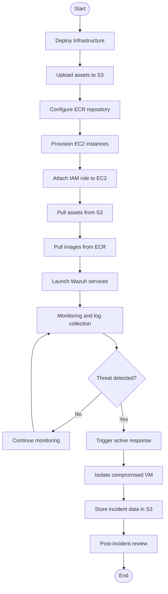

# UML Activity Diagram - Cloud SOC Wazuh Automation

## Overview

This UML activity diagram shows the key workflows for deployment and incident response, including S3/ECR interactions and security automation.

## Diagram

## Explanation

### Deployment Workflow
- **Deploy Infrastructure**: Terraform launches AWS resources and prepares the environment.
- **Upload assets to S3**: Configuration and Docker Compose files are stored in S3.
- **Configure ECR repository**: The container registry is prepared for image storage.
- **Provision EC2 instances**: Instances are created for Wazuh and test workloads.
- **Attach IAM role**: Instances receive secure access permissions.
- **Pull assets from S3**: Instances download required deployment files.
- **Pull images from ECR**: Instances download container images.
- **Launch Wazuh services**: The Wazuh stack starts on EC2.
- **Monitoring and log collection**: Wazuh collects security events in real-time.

### Incident Response Workflow
- **Threat detection**: Wazuh continuously checks for security incidents.
- **Trigger active response**: When a threat is detected, automated scripts run.
- **Isolate compromised VM**: The affected instance is moved into a containment group.
- **Store incident data in S3**: Evidence and logs are archived.
- **Post-incident review**: Team or system reviews the incident and updates the configuration.
