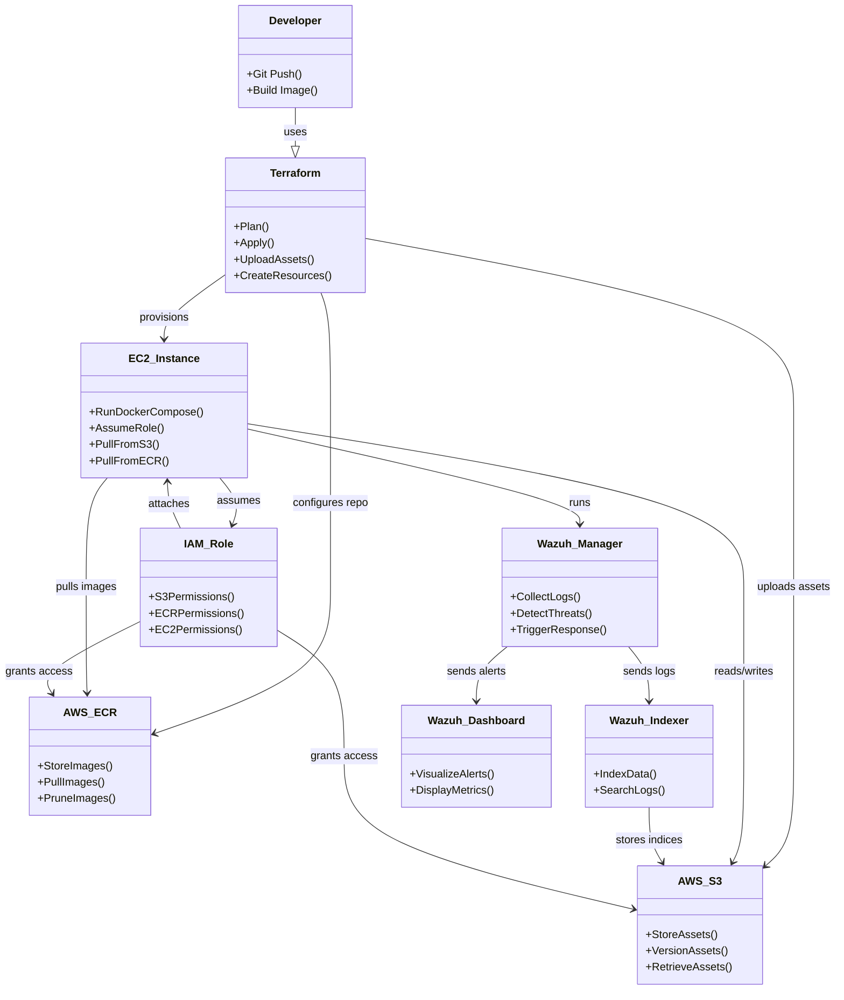

# UML Component Diagram - Cloud SOC Wazuh Automation

## Overview

This UML component diagram describes the main logical components of the Cloud SOC Wazuh Automation project and how they relate to each other.

## Diagram

## Explanation

- **Developer**: Authoring and pushing code, building container images, and triggering Terraform deployment.
- **Terraform**: Infrastructure-as-Code responsible for provisioning AWS resources, uploading S3 assets, and preparing the ECR repository.
- **AWS S3**: Stores configuration assets, Docker Compose files, and logs; versioning enables rollback.
- **AWS ECR**: Stores container images with lifecycle pruning of old builds.
- **EC2 Instance**: Hosts Wazuh services and pulls configuration/images from S3 and ECR using IAM credentials.
- **Wazuh Manager**: Central security engine that collects logs, detects threats, and triggers response.
- **Wazuh Indexer**: Indexes event data for search and analytics.
- **Wazuh Dashboard**: Visualizes alerts and security status.
- **IAM Role**: Grants EC2 instances the necessary access to AWS services without embedded credentials.
