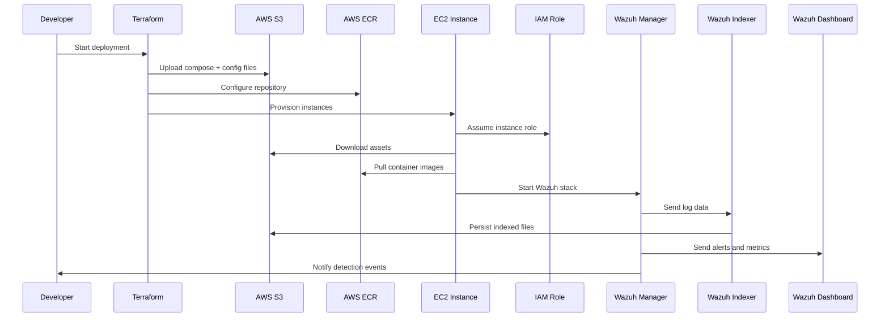

# UML Sequence Diagram - Cloud SOC Wazuh Automation

## Overview

This UML sequence diagram shows the interaction flow between developers, Terraform, AWS services, EC2 instances, and Wazuh components during deployment and runtime.

## Diagram

## Explanation

- **Developer** starts the infrastructure deployment by running Terraform.
- **Terraform** uploads required Wazuh Docker assets to S3 and sets up the ECR repository.
- **Terraform** also provisions EC2 instances and attaches IAM profiles.
- **EC2 instances** assume IAM roles to securely access S3 and ECR.
- **EC2 instances** download the Wazuh Docker Compose and related config from S3.
- **EC2 instances** pull container images from ECR.
- **Wazuh Manager** starts and sends log data to the indexer.
- **Wazuh Indexer** persists data and may write artifacts back to S3.
- **Wazuh Dashboard** consumes alerts and metrics for visualization.
- **Wazuh Manager** can notify developers or automation systems when threats are detected.
