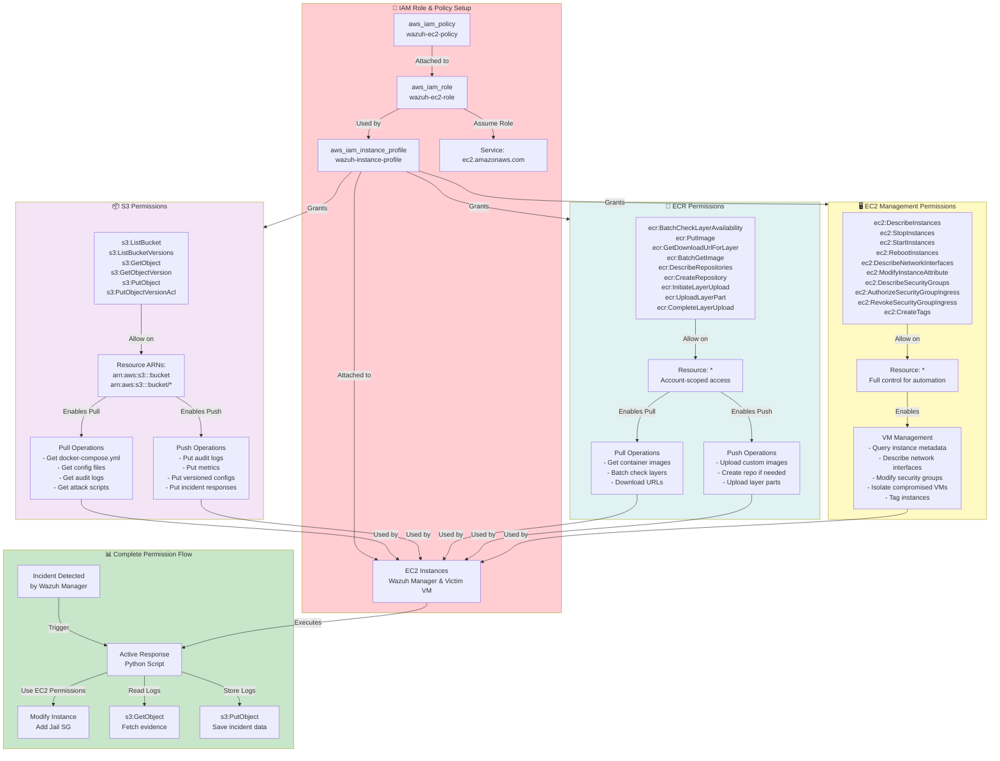

# IAM Permissions Architecture - S3, ECR & EC2 Integration

## Overview

This diagram details the IAM (Identity and Access Management) architecture that enables secure interactions between EC2 instances, S3 buckets, ECR repositories, and EC2 management operations. It shows how permissions are structured and used throughout the system.

## Diagram

## IAM Architecture Components

### IAM Role & Policy Setup (Red)
**Core Security Foundation**:
- **IAM Role**: `wazuh-ec2-role` - Defines the service that can assume the role
- **IAM Policy**: `wazuh-ec2-policy` - Contains specific permissions and restrictions
- **Instance Profile**: `wazuh-instance-profile` - Attaches role to EC2 instances
- **Trust Relationship**: Allows EC2 service to assume the role automatically

**Security Principle**: EC2 instances get temporary credentials through instance metadata, eliminating the need for hardcoded AWS credentials.

### S3 Permissions (Purple)
**Storage Access Control**:

**Permissions Granted**:
- `s3:ListBucket` - List objects in bucket
- `s3:ListBucketVersions` - List versioned objects
- `s3:GetObject` - Download files and configurations
- `s3:GetObjectVersion` - Access specific versions for rollback
- `s3:PutObject` - Upload logs, metrics, and incident data
- `s3:PutObjectVersionAcl` - Manage version access controls

**Resource Scope**: Limited to specific S3 bucket ARN for security

**Pull Operations**:
- Retrieve docker-compose.yml files
- Download configuration files
- Access audit logs and evidence
- Get attack simulation scripts

**Push Operations**:
- Store security audit logs
- Save performance metrics
- Upload versioned configurations
- Archive incident response data

### ECR Permissions (Cyan)
**Container Registry Access**:

**Permissions Granted**:
- `ecr:BatchCheckLayerAvailability` - Verify image layers exist
- `ecr:PutImage` - Upload container images
- `ecr:GetDownloadUrlForLayer` - Get download URLs for layers
- `ecr:BatchGetImage` - Download complete images
- `ecr:DescribeRepositories` - List and describe repositories
- `ecr:CreateRepository` - Create repositories if needed
- `ecr:InitiateLayerUpload` - Start layer upload process
- `ecr:UploadLayerPart` - Upload image layer parts
- `ecr:CompleteLayerUpload` - Finalize image uploads

**Resource Scope**: Account-wide access (`*`) for flexibility

**Pull Operations**:
- Download container images during deployment
- Batch verification of image layers
- Access to download URLs for efficient transfers

**Push Operations**:
- Upload custom-built container images
- Create repositories dynamically
- Multi-part upload of large image layers

### EC2 Management Permissions (Yellow)
**Virtual Machine Control**:

**Permissions Granted**:
- `ec2:DescribeInstances` - Query instance information
- `ec2:StopInstances` - Stop running instances
- `ec2:StartInstances` - Start stopped instances
- `ec2:RebootInstances` - Reboot instances
- `ec2:DescribeNetworkInterfaces` - Network interface information
- `ec2:ModifyInstanceAttribute` - Change instance attributes (security groups)
- `ec2:DescribeSecurityGroups` - Security group details
- `ec2:AuthorizeSecurityGroupIngress` - Add inbound rules
- `ec2:RevokeSecurityGroupIngress` - Remove inbound rules
- `ec2:CreateTags` - Add metadata tags

**Resource Scope**: Full account access (`*`) for automation

**Operations Enabled**:
- Query EC2 instance metadata
- Modify network interfaces and security groups
- Implement VM isolation during incidents
- Apply resource tagging for organization

## Complete Permission Flow Example

### Incident Response Scenario:
1. **Detection**: Wazuh Manager identifies security threat
2. **Trigger**: Active response Python script executes
3. **Authorization**: Script uses EC2 permissions to modify instance
4. **Isolation**: Compromised VM moved to "jail" security group
5. **Evidence**: Script reads incident logs using S3 permissions
6. **Archival**: Incident data saved to S3 using PutObject permission

## Security Best Practices

- **Least Privilege**: Each permission serves a specific operational need
- **Resource Restrictions**: S3 access limited to specific bucket ARNs
- **Temporary Credentials**: No long-term credentials stored on instances
- **Audit Trail**: All actions logged through CloudTrail
- **Version Control**: S3 versioning provides complete change history