# S3 & ECR Operational Scenarios - Data Flows

## Overview

This diagram illustrates different operational scenarios and data flows involving S3 and ECR services throughout the system's lifecycle, from initial deployment to incident response and rollback operations.

## Diagram

```mermaid
graph LR
    subgraph InitialDeploy["🚀 Initial Deployment Flow"]
        TF1["Terraform Plan<br/>&amp; Apply"] -->|Upload files<br/>md5 checksum| S3["S3 Assets"]
        TF1 -->|Configure| ECR1["ECR Repo<br/>Lifecycle Policy"]
        S3 -->|Pull on First Run| WM1["Wazuh Manager<br/>Initialization"]
        ECR1 -->|Pull Base Images| DI1["Docker Images"]
        DI1 -->|Run| WM1
    end

    subgraph RuntimeOperations["⚙️ Runtime Operations"]
        WM2["Wazuh Manager<br/>Running"] -->|Collects Logs| VI1["Victim Instance<br/>Agent"]
        VI1 -->|s3:PutObject<br/>audit logs| S3_RT["S3 Bucket"]
        WM2 -->|Stores Indices| IDX["Indexer"]
        IDX -->|Persists<br/>s3:PutObject| S3_RT
        WM2 -->|Real-time<br/>Monitoring| DASH["Dashboard<br/>OpenSearch"]
    end

    subgraph Incident["🚨 Incident Response Flow"]
        WM3["Wazuh Detects<br/>Threat"] -->|Triggers| RESP["Active Response<br/>Script"]
        RESP -->|Reads Env Vars| IAM_F["IAM Role"]
        IAM_F -->|Permissions| RESP
        RESP -->|ec2:ModifyInstanceAttribute<br/>+ Security Group| VI2["Isolate VM"]
    end

    subgraph RollbackScenario["↩️ Version Rollback Flow"]
        S3_VER["S3 Versioning<br/>Enabled"] -->|Previous Versions| V1["docker-compose v1.0"]
        S3_VER -->|Previous Versions| V2["docker-compose v2.0"]
        V1 -->|Get &amp; Re-deploy| WM4["Wazuh Manager<br/>Restored"]
        V2 -->|Get &amp; Re-deploy| WM5["Alternative Config"]
    end

    subgraph ECRScenario["🐳 ECR CI/CD Integration<br/>Future Ready"]
        DEV["Developer<br/>Builds Image"] -->|Push Image| ECR3["ECR Repository<br/>cloud-soc-wazuh-repo"]
        ECR3 -->|Lifecycle Policy<br/>Keep Last 3| PRUNE["Auto-Prune Old Images"]
        ECR3 -->|Pull Latest| EC2_PULL["EC2 Instances<br/>Pull &amp; Deploy"]
        PRUNE -->|Delete| IMG_OLD["Older Images<br/>Cleaned Up"]
    end

    style InitialDeploy fill:#c8e6c9
    style RuntimeOperations fill:#bbdefb
    style Incident fill:#ffccbc
    style RollbackScenario fill:#ffe0b2
    style ECRScenario fill:#f8bbd0
```

## Operational Scenarios Explained

### Initial Deployment Flow (Green)
**Purpose**: Setting up the entire SOC infrastructure from scratch

**Process**:
1. **Terraform Execution**: Plans and applies infrastructure changes
2. **Asset Upload**: Files uploaded to S3 with MD5 checksums for integrity
3. **ECR Configuration**: Repository created with lifecycle policies
4. **Service Initialization**: Wazuh Manager pulls configurations and images
5. **Container Launch**: Docker images run to start services

**Key Features**:
- MD5 checksums ensure file integrity during upload
- Automated ECR repository setup with cost optimization

### Runtime Operations (Blue)
**Purpose**: Normal operational data collection and storage

**Process**:
1. **Log Collection**: Wazuh Manager gathers logs from victim instances
2. **S3 Storage**: Audit logs and metrics stored in S3 bucket
3. **Index Storage**: Wazuh Indexer persists search indices to S3
4. **Dashboard Access**: Real-time monitoring through OpenSearch interface

**Key Features**:
- Continuous log streaming to S3 for long-term retention
- Index persistence for search and analytics capabilities

### Incident Response Flow (Red)
**Purpose**: Automated response to detected security threats

**Process**:
1. **Threat Detection**: Wazuh identifies security incidents
2. **Script Trigger**: Active response automation executes
3. **Permission Check**: IAM role validates access permissions
4. **VM Isolation**: Compromised instance isolated via security group changes

**Key Features**:
- Zero-touch incident response automation
- IAM-based secure access without hardcoded credentials

### Version Rollback Flow (Orange)
**Purpose**: Quick restoration to previous working configurations

**Process**:
1. **Version Access**: S3 versioning provides access to historical files
2. **Configuration Selection**: Choose specific version (v1.0, v2.0, etc.)
3. **Redeployment**: Pull and apply previous configuration
4. **Service Restoration**: Wazuh Manager restored to known good state

**Key Features**:
- Instant rollback capability without external backups
- Complete version history maintained automatically

### ECR CI/CD Integration (Pink)
**Purpose**: Future-ready container image management pipeline

**Process**:
1. **Image Building**: Developer creates custom container images
2. **ECR Push**: Images uploaded to registry with versioning
3. **Lifecycle Management**: Automatic cleanup of old images
4. **Deployment Pull**: EC2 instances pull latest images for updates

**Key Features**:
- Cost optimization through automatic image pruning
- Ready for CI/CD pipeline integration
- Version-controlled container deployments

## Data Flow Patterns

### S3 Operations
- **Upload**: Terraform uploads configurations and assets
- **Download**: EC2 instances pull files during deployment
- **Storage**: Runtime logs and metrics stored for analysis
- **Versioning**: All changes tracked for rollback scenarios

### ECR Operations
- **Push**: Custom images uploaded by developers
- **Pull**: Container images downloaded during deployment
- **Lifecycle**: Automatic cleanup based on retention policies
- **Integration**: Ready for automated build pipelines

### Security Considerations
- All operations use IAM roles and policies
- No direct credential exposure in automation scripts
- Encrypted storage and secure access controls
- Audit trails maintained through versioning