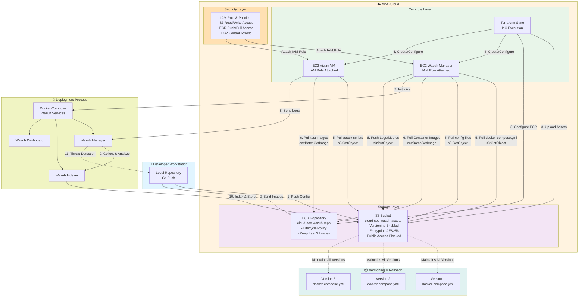

# S3 & ECR Workflow with System Interactions - Detailed Architecture

## Overview

This diagram provides a detailed view of how S3 and ECR services integrate with the overall system architecture, showing data flows, permissions, and operational interactions.

## Diagram

## Key Components Explained

### Developer Workstation (Light Blue)
- **Local Repository**: Developer's local Git repository
- **Git Push**: Configuration changes and code updates

### AWS Cloud Infrastructure (Light Orange)

#### Storage Layer (Purple)
- **S3 Bucket**: Secure, versioned storage with encryption
  - Versioning enabled for rollback capabilities
  - AES256 encryption for data protection
  - Public access completely blocked
- **ECR Repository**: Container registry with lifecycle management
  - Automatic cleanup of old images
  - Cost optimization through retention policies

#### Compute Layer (Light Green)
- **Terraform State**: Infrastructure as Code execution
- **EC2 Wazuh Manager**: Main security server with IAM permissions
- **EC2 Victim VM**: Test environment with IAM permissions

#### Security Layer (Light Orange)
- **IAM Role & Policies**: Least-privilege access control
  - S3 read/write permissions for configurations and logs
  - ECR push/pull permissions for container images
  - EC2 control permissions for automation scripts

### Deployment Process (Light Yellow)
- **Docker Compose**: Container orchestration
- **Wazuh Services**: Manager, Indexer, and Dashboard components

### Versioning & Rollback (Light Cyan)
- **S3 Versioning**: Maintains all historical versions
- **Rollback Capability**: Instant restoration to previous configurations

## Workflow Flow

1. **Configuration Push**: Developer pushes configs to S3
2. **Image Building**: Custom container images pushed to ECR
3. **Infrastructure Setup**: Terraform uploads assets and configures services
4. **Instance Creation**: EC2 instances created with IAM roles attached
5. **Asset Retrieval**: Instances pull configurations and images from S3/ECR
6. **Service Initialization**: Docker Compose launches Wazuh services
7. **Runtime Operations**: Logs and metrics stored back to S3
8. **Threat Detection**: Wazuh analyzes logs and detects incidents
9. **Version Control**: S3 maintains all versions for rollback scenarios

## Security Features

- **IAM Instance Profiles**: No hardcoded credentials on EC2 instances
- **S3 Encryption**: All data encrypted at rest
- **Public Access Blocked**: S3 bucket completely private
- **Versioning**: Complete audit trail of configuration changes
- **Lifecycle Policies**: Automatic cleanup of ECR images