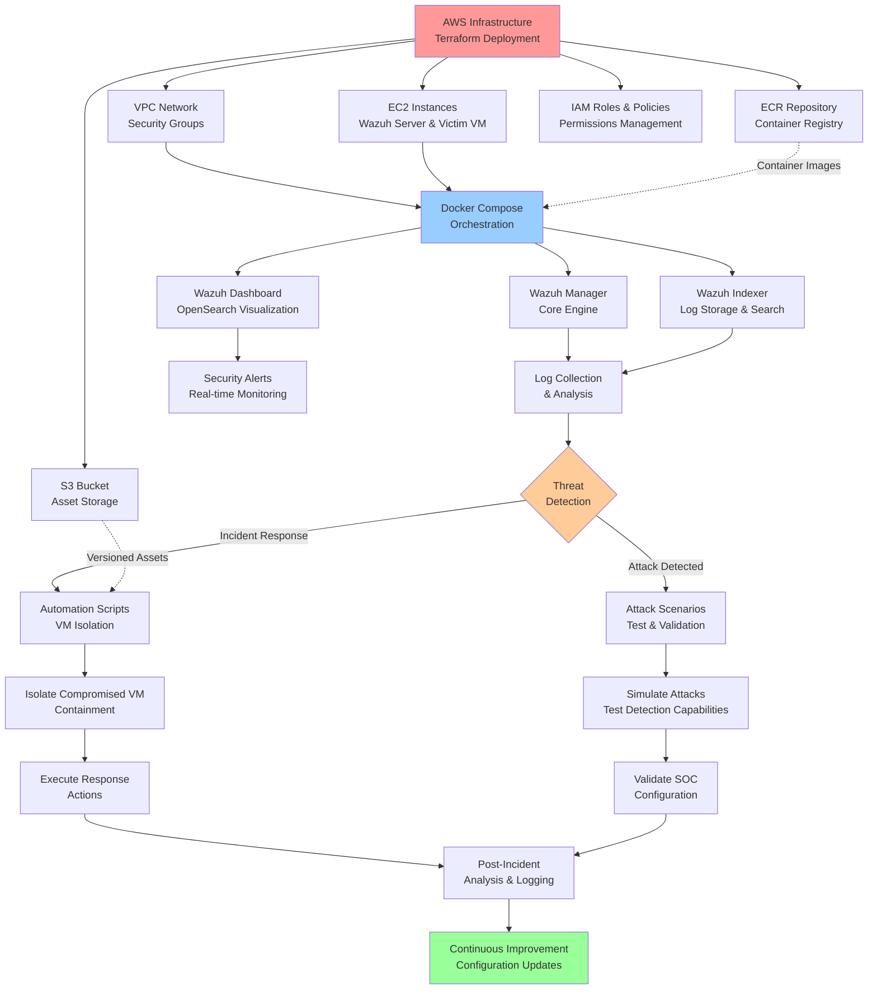

# Cloud SOC Wazuh Automation - System Workflow

## Overview

This diagram illustrates the complete workflow of the Cloud SOC Wazuh Automation system, showing how all components interact from infrastructure deployment to incident response.

## Diagram

## Key Components Explained

### Infrastructure Layer (Red)
- **AWS Infrastructure**: Terraform provisions all cloud resources
- **VPC Network & Security Groups**: Isolated network environment with security controls
- **EC2 Instances**: Wazuh server and victim VM for testing
- **S3 Bucket**: Versioned storage for configurations and assets
- **ECR Repository**: Container registry for Docker images
- **IAM Roles & Policies**: Secure permissions for automation

### Container Layer (Blue)
- **Docker Compose**: Orchestrates Wazuh services deployment
- **Wazuh Manager**: Core security engine for threat detection
- **Wazuh Indexer**: Log storage and search capabilities
- **Wazuh Dashboard**: OpenSearch visualization interface

### Security Operations (Orange)
- **Log Collection & Analysis**: Gathers and processes security events
- **Security Alerts**: Real-time monitoring and notifications
- **Threat Detection**: Automated identification of security incidents

### Response Flow
- **Attack Scenarios**: Testing and validation of detection capabilities
- **Automation Scripts**: VM isolation and incident response actions
- **Post-Incident Analysis**: Review and improvement of SOC configuration

## Workflow Flow

1. **Infrastructure Setup**: Terraform deploys AWS resources
2. **Service Deployment**: Docker Compose launches Wazuh components
3. **Monitoring**: Wazuh collects and analyzes logs in real-time
4. **Detection**: Automated threat identification
5. **Response**: Either testing scenarios or incident containment
6. **Analysis**: Post-incident review and configuration updates