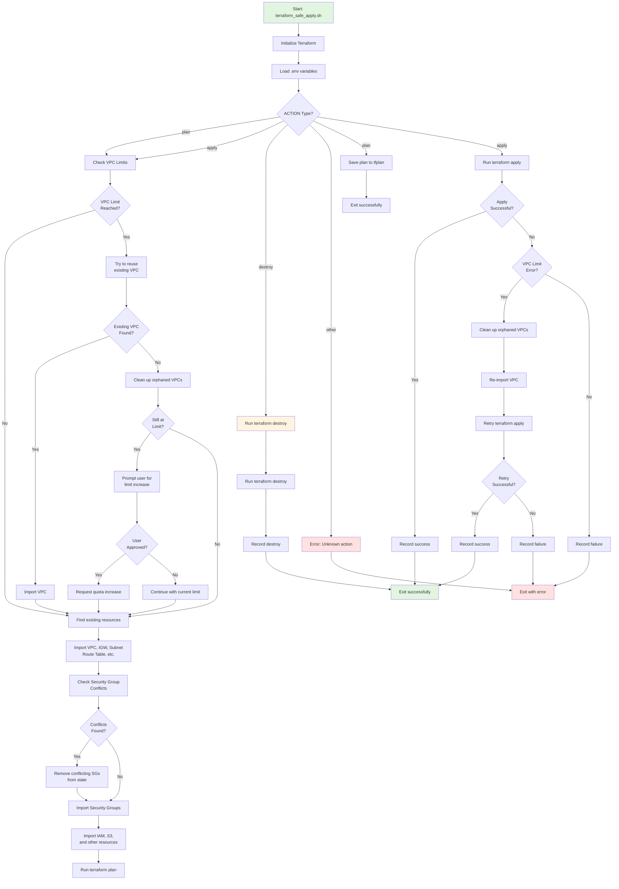

# Cloud SOC Wazuh Automation - Terraform Infrastructure

This repository contains the Terraform configuration for deploying a Cloud Security Operations Center (SOC) using Wazuh, integrated with AWS services like S3 and ECR for secure, versioned asset management and containerized deployments.

## Overview

The infrastructure includes:
- **VPC and Networking**: Isolated VPC with public subnets, internet gateway, and route tables. The deployment script automatically handles VPC limits by reusing existing VPCs or cleaning up orphaned ones.
- **Security Groups**: Separate groups for Wazuh server, victim VM, and jail (isolation) security group.
- **EC2 Instances**: Wazuh server and victim server with IAM roles for automation.
- **S3 Bucket**: Versioned storage for SOC assets (e.g., Docker Compose files, scripts).
- **ECR Repository**: Container registry with lifecycle policies for image management.
- **IAM Policies**: Permissions for EC2 instances to interact with S3, ECR, and EC2 services.

## Features

- **State-Aware Safe Apply**: The `terraform_safe_apply.sh` script automatically discovers and imports existing AWS resources to prevent duplicate creations, enabling safe redeployments even after Codespace timeouts.
- **VPC Limit Management**: Automatically handles AWS VPC limits by reusing existing VPCs, cleaning up orphaned resources, and prompting for limit increases when needed.
- **Security Group Conflict Resolution**: Automatically detects and resolves security group conflicts when importing VPCs from different environments.
- **Versioning Support**:
  - S3 bucket with versioning enabled for rollback of configurations.
  - ECR repository with lifecycle policy to retain the last 3 images, ensuring cost-effective version management.
- **Secure by Design**: All resources are encrypted, public access is blocked, and IAM roles follow least-privilege principles.
- **Modular Configuration**: Infrastructure is split into specialized files (vpc.tf, iam.tf, s3.tf, ecr.tf, etc.) for maintainability.
- **Automation Ready**: EC2 instances have permissions to pull from S3 and ECR, supporting automated deployments and response scripts.

## Prerequisites

- AWS CLI configured with appropriate credentials.
- Terraform v1.0+ installed.
- Bash environment (e.g., GitHub Codespaces).
- Optional: `.env` file for environment variables (e.g., custom bucket/repo names).

## Usage

### Initial Setup

1. Navigate to the `terraform/` directory:
   ```bash
   cd terraform
   ```

2. Initialize Terraform:
   ```bash
   terraform init -input=false
   ```

3. (Optional) Load environment variables from `.env`:
   ```bash
   source .env
   ```

### Safe Apply Script

Use the provided `terraform_safe_apply.sh` script for state-aware deployments:

- **Plan**: `./terraform_safe_apply.sh plan`
- **Apply**: `./terraform_safe_apply.sh apply` (default action)
- **Destroy**: `./terraform_safe_apply.sh destroy`

The script:
- Imports existing resources if they exist in AWS but not in Terraform state.
- Records deployment history in `terraform_safe_apply_history.json`.
- Supports custom arguments via `--auto-approve` or other Terraform flags.
- **Automatically handles AWS VPC limits** by reusing existing VPCs or cleaning up orphaned ones.
- **Prompts for confirmation** before requesting VPC limit increases to avoid unexpected costs.
- **Retries failed deployments** due to VPC limits after automatic cleanup.

#### VPC Limit Management
When VPC limits are reached (default: 5 VPCs per region), the script:
1. **Reuses existing VPCs** with matching project tags (`Project=cloud-soc`)
2. **Cleans up orphaned VPCs** that have no dependencies (subnets, IGWs, custom security groups)
3. **Prompts for limit increase** if cleanup is insufficient
4. **Resolves security group conflicts** automatically by importing existing groups or removing conflicting ones
5. **Retries deployment** after successful cleanup

#### Security Group Conflict Resolution
The script automatically handles security group conflicts that can occur when importing VPCs:
- **Detects existing security groups** in imported VPCs
- **Imports compatible groups** instead of creating duplicates
- **Removes conflicting groups** from state when VPC changes
- **Prevents deployment failures** due to duplicate names

Example:
```bash
./terraform_safe_apply.sh apply --auto-approve
```

### Script Workflow Diagram

The following diagram illustrates the complete workflow of the `terraform_safe_apply.sh` script:



**Diagram Legend:**
- 🟢 **Green nodes**: Start and successful completion
- 🔴 **Red nodes**: Errors or invalid actions
- 🟡 **Yellow nodes**: Destruction operations
- **Diamond nodes**: Decision points (if/else logic)

### Manual Terraform Commands

If needed, run Terraform directly:
```bash
terraform plan -out=tfplan
terraform apply -auto-approve tfplan
terraform destroy
```

## Project Structure

- `iam.tf`: IAM roles, policies, and instance profiles for EC2 automation.
- `instance.tf`: EC2 instances (Wazuh server and victim VM).
- `network.tf`: VPC, subnets, internet gateway, route tables.
- `providers.tf`: AWS provider configuration.
- `security_groups.tf`: Security groups for network isolation.
- `s3.tf`: S3 bucket with versioning, encryption, and public access block.
- `ecr.tf`: ECR repository with lifecycle policy for image retention.
- `outputs.tf`: Terraform outputs (e.g., instance IPs, S3 bucket name, ECR URL).
- `variables.tf`: Input variables (e.g., bucket/repo names, destroy protection).
- `terraform_safe_apply.sh`: Bash script for safe, state-aware deployments.
- `terraform_safe_apply_history.json`: JSON log of deployment actions.
- `terraform_safe_apply_changelog.md`: Changelog for script updates.
- `README.md`: This file.

## Key Configurations

### S3 Bucket
- **Name**: `cloud-soc-wazuh-assets` (configurable via `s3_bucket_name` variable).
- **Versioning**: Enabled for configuration rollback.
- **Encryption**: AES256 server-side encryption.
- **Public Access**: Blocked for security.

### ECR Repository
- **Name**: `cloud-soc-wazuh-repo` (configurable via `ecr_repository_name` variable).
- **Lifecycle Policy**: Retains last 3 images; deletes older ones to manage costs.
- **Mutability**: Tags are mutable for easy updates.
- **Wazuh Docker Integration**: The S3 bucket stores Wazuh docker configuration files from `wazuh-docker/` directory, which are deployed to EC2.

### IAM Permissions
- **EC2 Role**: `wazuh-ec2-role` with permissions for:
  - EC2 management (isolation, tagging).
  - S3 operations (get/put/list versions).
  - ECR operations (push/pull images).

## Outputs

After deployment, key outputs include:
- `vpc_id`: VPC ID.
- `public_subnet_id`: Public subnet ID.
- `wazuh_instance_public_ip`: Wazuh server public IP.
- `victim_instance_ip`: Victim server private IP.
- `s3_bucket_name`: S3 bucket name.
- `ecr_repository_url`: ECR repository URL.

## Security Considerations

- All resources are tagged with `Project=cloud-soc` for easy identification.
- S3 bucket blocks public access and uses encryption.
- IAM policies follow least-privilege; no wildcard resources where avoidable.
- Use the safe apply script to avoid accidental duplicate resources.

## Troubleshooting

- **Import Errors**: If resources exist in AWS but not in state, the script will attempt to import them. Check AWS console if imports fail.
- **Permissions Issues**: Ensure AWS CLI is configured with sufficient permissions (e.g., EC2, S3, ECR, IAM).
- **State Drift**: The safe apply script mitigates this by importing existing resources.
- **VPC Limit Errors**: The script automatically handles VPC limits by reusing existing VPCs, cleaning up orphaned ones, and prompting for limit increases when needed.
- **Security Group Conflicts**: The script automatically detects and resolves conflicts when importing VPCs with existing security groups.
- **History Logs**: Check `terraform_safe_apply_history.json` for deployment status.

## Contributing

1. Fork the repository.
2. Create a feature branch.
3. Make changes and test with `terraform validate` and `terraform plan`.
4. Submit a pull request.

## License

This project is licensed under the MIT License - see the LICENSE file in the root directory.